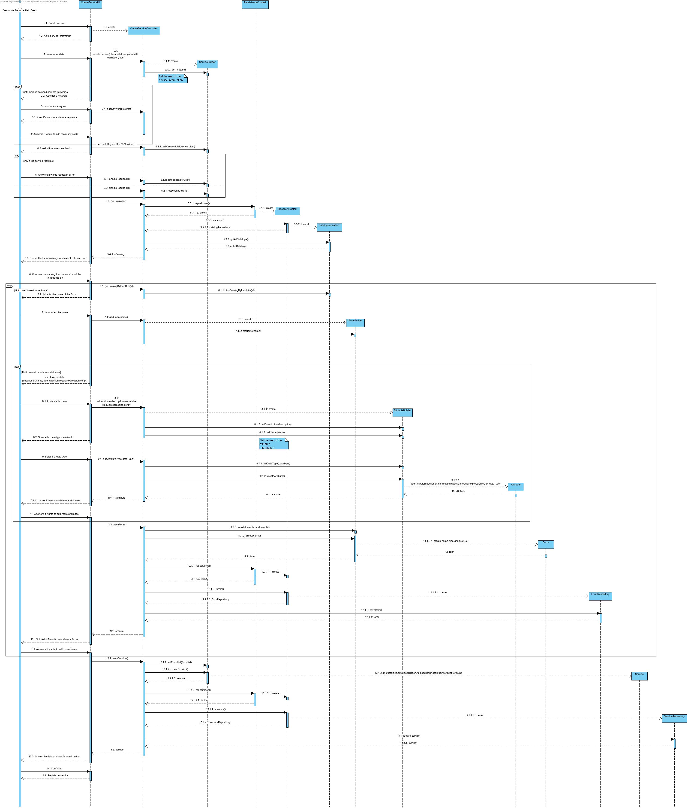

# UC 2002

# 1. Requisitos
**2002** Como Gestor de Serviços de Help desk (GSH) pretendo proceder à especificação de um novo serviço e permitir que a mesma fique incompleta.
 - Demo2002.2 criar um novo serviço atribuindo-lhe um catálogo.
 - Demo2002.3 criar um novo serviço e os seus respetivo/os formulário/os.
A interpretação feita deste requisito foi no sentido de criar um serviço com todos os atributos necessários para a sua criação.

# 2. Análise
A análise foi realizada tendo em conta as reuniões com o Cliente e as respostas dadas no Fórum para esclarecimento de dúvidas.
- O serviço é identificado por um código, por um icone e por um título que devem ser únicos.
- O serviço é caracterizado por uma descrição breve e uma completa.
- O título deve ter um máximo de 50 caracteres.
- A descrição breve deve ter uma máximo de 40 caracteres.
- A descrição completa deve ter um máximo de 100 caracteres.
- O serviço tem acossiado um catálogo onde é disponibilizado.
- O serviço é caracterizado por um formulário.
- O serviço pode não conter todos os seus atributos.

# 3. Design  
Para realizar esta funcionalidade a equipa usou o padrão Controller e Repository.
Foi criado o CreateServiceController que será responsável pela criação de serviços no sistema.
Para persistir a informação no sistema usou-se o padrão Repository.
Dado que um serviço possui um catálogo este irá buscar os catálogos disponiveis para posteriormente ser selecionada o que melhor se adequa.
Dado que o serviço é caracterizado por um ou mais formulários este terá que ser criado.
Dado que um formulário é caracterizado por um ou mais atributos, estes terão que ser criados.
Após serem selecionadas e introduzidas (todas as/parte das) informações é criado um serviço.
O Controller assim utilizada a Classe Service para puder crar uma instância de um serviço.
O Controller usa o ServiceRepository para guardar a informação sobre esse novo serviço criado na base de dados.
O Controller usa o FormRepository para guardar a informação sobre esse novo formulário criado na base de dados.

## 3.1. Realização da Funcionalidade

## 3.2. Diagrama de Classes
Por indicação do professor, não é necessário elaborar o Diagrama de Classes.

## 3.3. Padrões Aplicados
O padrão aplicado foi o padrão Controller e Repository.

## 3.4. Testes

# 4. Implemntação
Apesar de no SD se encontrarem os métodos set (ex:setName(name)), usou-se na realidade os métodos with (ex:withName(name)).
