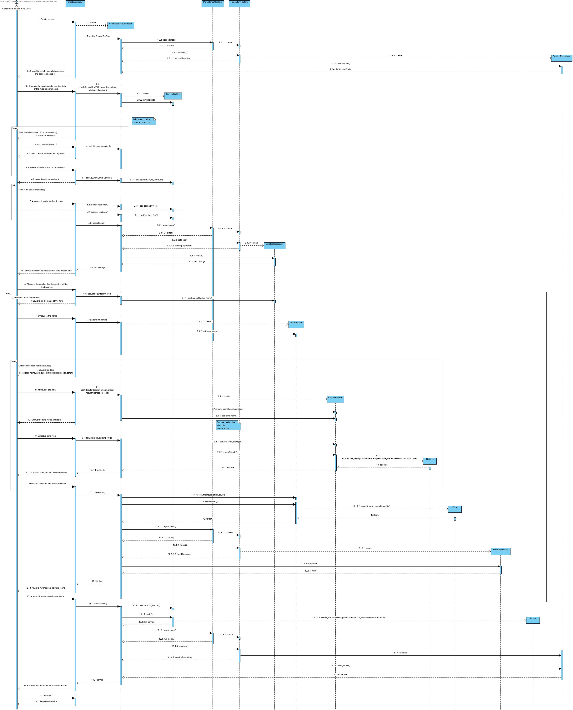

# UC 2003

# 1. Requisitos
**2003** Como Gestor de Serviços de Help desk (GSH) pretendo continuar/completar a especificação em curso de um serviço.
 - Demo2002.2 continuar a especificação em curso de um serviço atribuindo-lhe um catálogo.
 - Demo2002.3 continuar a especificação em curso de um serviço criando um ou mais formulários.
 - Demo2002.4 continuar a especificação em curso de um serviço inserindo os dados em falta.
A interpretação feita deste requisito foi no sentido de continuar/completar a especificação em curso de um serviço, introduzindo os atributos em falta necessários para a sua criação.

# 2. Análise
A análise foi realizada tendo em conta as reuniões com o Cliente e as respostas dadas no Fórum para esclarecimento de dúvidas.
- O serviço é identificado por um código, por um icone e por um título que devem ser únicos.
- O serviço é caracterizado por uma descrição breve e uma completa.
- O título deve ter um máximo de 50 caracteres.
- A descrição breve deve ter uma máximo de 40 caracteres.
- A descrição completa deve ter um máximo de 100 caracteres.
- O serviço tem associado um catálogo onde é disponibilizado.
- O serviço é caracterizado por um formulário.
- O serviço pode não conter todos os seus atributos.

### Pre-requisitos:
- Tem que haver serviços por terminar já guardados na aplicação.
- Tem que haver catálogos já guardados na aplicação.
- Tem que haver formulários para criar.

### Pós-requisitos:
\n

## 3.1. Realização da Funcionalidade
