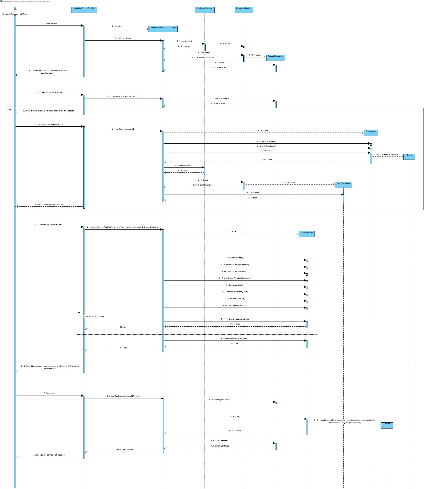

# UC 2003

# 1. Requisitos
**2003** Como Gestor de Serviços de Help desk (GSH) pretendo continuar/completar a especificação em curso de um serviço.
 - Demo2002.2 continuar a especificação em curso de um serviço atribuindo-lhe um titulo.
 - Demo2002.3 continuar a especificação em curso de um serviço atribuindo-lhe uma descrição curta.
 - Demo2002.4 continuar a especificação em curso de um serviço atribuindo-lhe uma descrição completa.
 - Demo2002.4 continuar a especificação em curso de um serviço atribuindo-lhe um icon.
 - Demo2002.4 continuar a especificação em curso de um serviço atribuindo-lhe uma indicação se requer feedback.
A interpretação feita deste requisito foi no sentido de continuar/completar a especificação em curso de um serviço, introduzindo os atributos em falta necessários para a sua criação.

# 2. Análise
A análise foi realizada tendo em conta as reuniões com o Cliente e as respostas dadas no Fórum para esclarecimento de dúvidas.
- O serviço é identificado por um código, por um icone e por um título que devem ser únicos.
- O serviço é caracterizado por uma descrição breve e uma completa.
- O título deve ter um máximo de 50 caracteres.
- A descrição breve deve ter uma máximo de 40 caracteres.
- A descrição completa deve ter um máximo de 100 caracteres.
- O serviço tem associado um catálogo onde é disponibilizado.
- O serviço é caracterizado por um formulário.
- O serviço pode não conter todos os seus atributos.

### Pre-requisitos:
- Tem que haver serviços por terminar já guardados na aplicação.
- Tem que haver catálogos já guardados na aplicação.

### Pós-requisitos:
\n

## 3.1. Realização da Funcionalidade

## 3.2. Diagrama de Classes
Por indicação do professor, não é necessário elaborar o Diagrama de Classes.

## 3.3. Padrões Aplicados
O padrão aplicado foi o padrão Controller, Repository e Builder.

## 3.4. Testes 
*Nesta secção deve sistematizar como os testes foram concebidos para permitir uma correta aferição da satisfação dos requisitos.*

**Teste 1:** Verificar que não é possível criar uma instância da classe Service com Lista de formulários, titulo, descrição completa, descrição curta, ValueObject que indica se é necessário feedback ou icon nulos.
	
	Preconditions.noneNull(form,title,fulldescription, smalldescription, requirefeedback, icon);
	
**Teste 2:** Verificar que não é possível criar uma instância da classe Service com titulo com mais de 50 caracteres.

	if (title.length()>50){
            throw new IllegalArgumentException("the title of the service is superior to 50 caracters");
        }

**Teste 3:** Verificar que não é possível criar uma instância da classe Service com descrição curta com mais de 40 caracteres.

	if (smalldescription.length()>40){
            throw new IllegalArgumentException("the small description of the service is superior to 40 caracters");
        }

**Teste 4:** Verificar que não é possível criar uma instância da classe Service com descrição completa com mais de 500 caracteres.

	if (fulldescription.length()>500){
            throw new IllegalArgumentException("the full description of the service is superior to 500 caracters");
        }
		
# 4. Implementação
Todas as representações do design efetuado estão de acordo com a implementação.