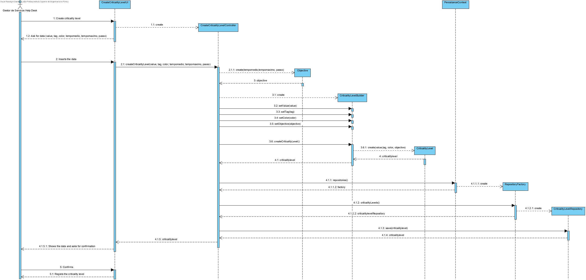

# UC 2002

# 1. Requisitos
**2002** Como Gestor de Serviços de Help desk (GSH) pretendo proceder à especificação de um novo nível de criticidade.
 - Demo2002.2 criar um novo nível de criticidade atribuindo-lhe um valor.
 - Demo2002.2 criar um novo nível de criticidade atribuindo-lhe um etiqueta.
 - Demo2002.2 criar um novo nível de criticidade atribuindo-lhe um cor.
 - Demo2002.2 criar um novo nível de criticidade atribuindo-lhe os objetivos.
A interpretação feita deste requisito foi no sentido de criar um serviço com todos os atributos necessários para a sua criação.

# 2. Análise
A análise foi realizada tendo em conta as reuniões com o Cliente e as respostas dadas no Fórum para esclarecimento de dúvidas.
- O nível de criticidade é caracterizado por um valor, uma etiqueta, cor, pelos objetivos.

# 3. Design  
Para realizar esta funcionalidade a equipa usou o padrão Controller e Repository.
Foi criado o CreateCriticalylevelController que será responsável pela criação de um novo nível de criticidade no sistema.
Para persistir a informação no sistema usou-se o padrão Repository.
O Controller assim utilizada a Classe Criticalitylevel para puder crar uma instância de um serviço.
O Controller usa o CriticalitylevelRepository para guardar a informação sobre esse novo serviço criado na base de dados.

## 3.1. Realização da Funcionalidade

## 3.2. Diagrama de Classes
Por indicação do professor, não é necessário elaborar o Diagrama de Classes.

## 3.3. Padrões Aplicados
O padrão aplicado foi o padrão Controller e Repository.

