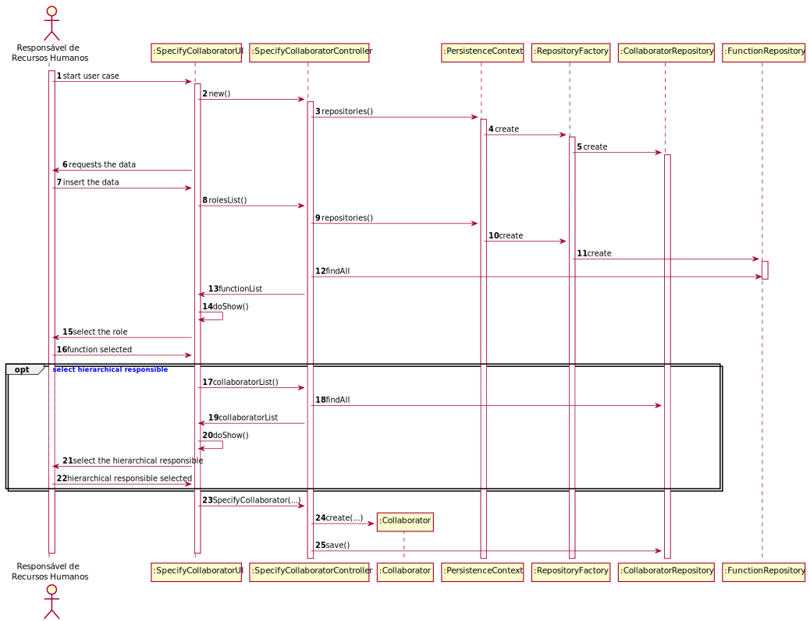

US2051 - Especificação de Colaborador
=======================================

# 1. Requisitos

O Responsável de Recursos Humanos (RRH) pretende proceder à especificação de um novo colaborador de modo a que este possa, posteriormente, aceder e usar o sistema. Um colaborador caracteriza-se pelo seu número mecanográfico, nome curto (i.e., pelo qual é comummente tratado), nome completo, data de nascimento, local de residência, endereço de email institucional, número de contacto (e.g. telemóvel, telefone), pela função que desempenha e, caso exista, pela indicação de quem é o seu responsável hierárquico atual na organização (i.e., outro colaborador).

# 2. Análise

Este caso de uso pretende permitir a especificação de um colaborador. Onde seus dados pessoais serão validados, a função deve estar previamente especificada e poderá ou não indicar seu responsável hierárquico.

## 2.1 Pré-requisito

Funções já definidas

## 2.2 Pós-requisito

Colaborador Especificado

# 3. Design

O diagrama doptado foi o diagrama de sequência, a fim de descrever o fluxo de realização do caso de uso. Satisfazendo a funcionalidade desejada.

## 3.1. Realização da Funcionalidade

Quando o ator inicia o caso de uso: o sistema solicita os dados pessoais do colaborador, os dados são validados. É apresentada a lista de funções para a indicação da mesma. E pode indicar o responsável hierárquico, se for o caso. Tendo concluído todas estas etapas corretamente, o colaborador é especificado com sucesso.

SD:

## 3.2. Padrões Aplicados

*Nesta secção deve apresentar e explicar quais e como foram os padrões de design aplicados e as melhores práticas.*

## 3.3. Testes 

Foram realizados testes para garantir a integridade dos requisitos
*Nesta secção deve sistematizar como os testes foram concebidos para permitir uma correta aferição da satisfação dos requisitos.*

**Teste 1:** Verificar que não é possível criar uma instância da classe Exemplo com valores nulos.

	@Test(expected = IllegalArgumentException.class)
		public void ensureNullIsNotAllowed() {
		Exemplo instance = new Exemplo(null, null);
	}

# 4. Implementação

*Nesta secção a equipa deve providenciar, se necessário, algumas evidências de que a implementação está em conformidade com o design efetuado. Para além disso, deve mencionar/descrever a existência de outros ficheiros (e.g. de configuração) relevantes e destacar commits relevantes;*

*Recomenda-se que organize este conteúdo por subsecções.*

# 5. Integração/Demonstração

*Nesta secção a equipa deve descrever os esforços realizados no sentido de integrar a funcionalidade desenvolvida com as restantes funcionalidades do sistema.*