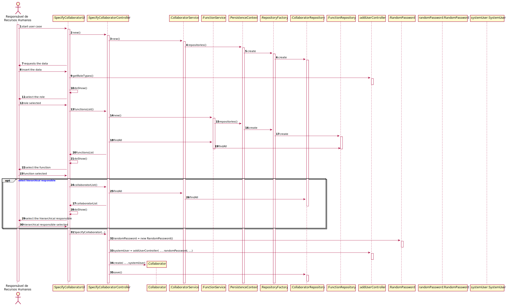

US2051 - Especificação de Colaborador
=======================================

# 1. Requisitos

O Responsável de Recursos Humanos (RRH) pretende proceder à especificação de um novo colaborador de modo a que este possa, posteriormente, aceder e usar o sistema. Um colaborador caracteriza-se pelo seu número mecanográfico, nome curto (i.e., pelo qual é comummente tratado), nome completo, data de nascimento, local de residência, endereço de email institucional, número de contacto (e.g. telemóvel, telefone), pela função que desempenha e, caso exista, pela indicação de quem é o seu responsável hierárquico atual na organização (i.e., outro colaborador).

# 2. Análise

Este caso de uso pretende permitir a especificação de um colaborador. Onde seus dados pessoais serão validados, a função deve estar previamente especificada e poderá ou não indicar seu responsável hierárquico.

## 2.1 Pré-requisito

* Funções já definidas

## 2.2 Pós-requisito

* Colaborador Especificado

# 3. Design

O diagrama doptado foi o diagrama de sequência, a fim de descrever o fluxo de realização do caso de uso. Satisfazendo a funcionalidade desejada.

## 3.1. Realização da Funcionalidade

Quando o ator inicia o caso de uso: o sistema solicita os dados pessoais do colaborador. É apresentada a 
lista de funções para a indicação da mesma. E pode indicar o responsável hierárquico, se for o caso. Os dados são validados. Tendo concluído estas 
etapas corretamente, o colaborador é especificado com sucesso.

**SD:**

## 3.2. Padrões Aplicados

Foram aplicados os padrões:
* **Repository:** Para comunicar com a base de dados, ter acesso aos dados
                    por meio das queries feitas.
* **Use-Case Controller:** Para gerir o fluxo de execução do caso de uso. 
* **Visitor:** Para navegar sobre os objetos Function e Collaborator e permitir 
                    mostrá-los ao utilizador.

## 3.3. Testes 

Foram realizados testes para garantir a integridade dos requisitos:

**Teste 1:** Verificar que não é possível criar um colaborador com número mecanográfico nulo.

	@Test(expected = IllegalArgumentException.class)
    public void ensureMecanographicNumberNotNull() {
        System.out.println("must have a Mecanographic Number!");
        new ClientUserBuilder().withMecanographicNumber((MecanographicNumber) null)
                .withSystemUser(getNewUser1()).build();
    }

# 4. Implementação

# 5. Integração/Demonstração

Este caso de uso é dependente da função, portanto para o seu completo funcionamento é 
necessário que esta esteja definida. E para efeitos de demonstração, encontra-se 
adicionado nas opções de menu da aplicação.
