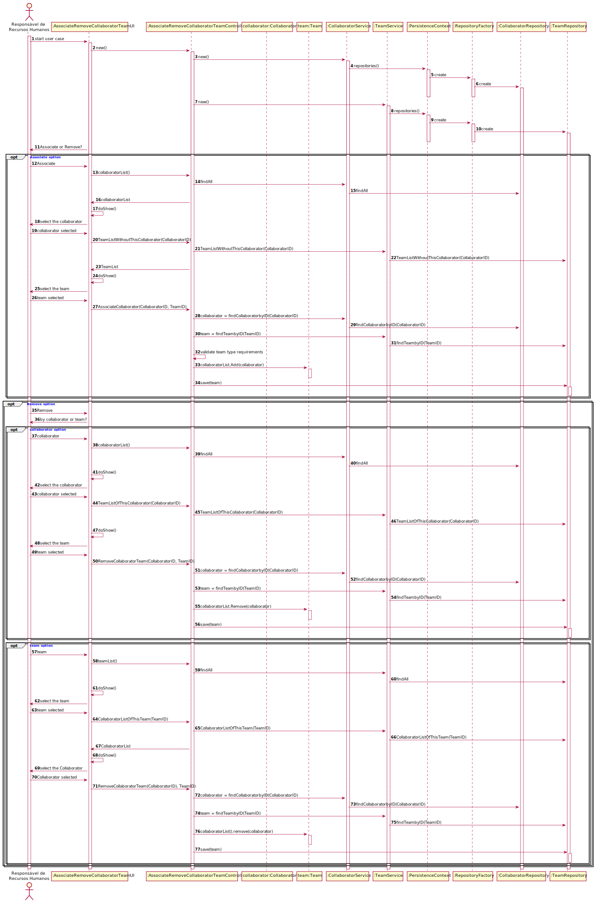

US2053 - Associar ou Remover Colaborador a uma equipa
=======================================

# 1. Requisitos

O Responsável de Recursos Humanos (RRH) pretende associar/remover um colaborador a uma equipa. Um colaborador pode pertencer a uma ou mais equipa. Contudo, não poderá pertencer a duas equipas do mesmo tipo. Assim está UC é dependente das UCs 2052 (Criação de uma nova equipa) e 2054 (Registo de um novo tipo de equipa).

# 2. Análise

Este caso de uso pretende permitir associar/remover um colaborador a uma equipa. Um colaborador pode estar associado a várias equipas distintas e uma equipa pode ter vários colaboradores associados. Ao remover o último colaborador de uma equipa é enviada uma mensagem de aviso.

## 2.1 Pré-requisito

* Colaborador e Equipa definidos
  
* Equipa com colaborador associado

## 2.2 Pós-requisito

* Colaborador associado ou removido à Equipa

# 3. Design

O diagrama doptado foi o diagrama de sequência, a fim de descrever o fluxo de realização do caso de uso. Satisfazendo a funcionalidade desejada.

## 3.1. Realização da Funcionalidade

Quando o ator inicia o caso de uso: o sistema solicita a escolha da opção (Associar ou Remover), caso o utilizador escolha a opção associar, é apresentado a lista dos colaboradores, o utilizador selecioana um e a seguir é apresentado a lista de equipas em que este colaborador não está associado, o utilizador seleciona a equipa a que pretende associar, é validado se o colaborador não pertence a outra equipa do mesmo tipo, e caso não, a informação é atualizada na base de dados. 

Caso a opção seja Remover, o sistema questiona se será por colaborador ou por equipa, caso seja por colaborador, o sistema apresenta a lista dos colaboradores, o colaborador é seleciona e a seguir é apresentado a lista de equipas que este colaborador faz parte, a equipa desejada é selecionada e a informação da remoção é atualizada na base de dados. Caso seja escolhida a opção por equipa, o sistema apresenta a lista de equipas, a equipa é seleciona e a seguir é apresentado a lista de colaboradores da equipa, o colaborador desejado é selecionado e os dados da remoção são atualizados na base de dados.

**Fluxo Aternativo:**
 
 * Caso o utilizador já faça parte de uma equipa do mesmo tipo da selecionada (no caso da associação), é apresentado um aviso e a caso de uso termina.
 * Caso o colaborador não esteja associado a nenhuma equipa (no caso da remoção), é apresentado um aviso e a caso de uso termina.

**SD:**

## 3.2. Padrões Aplicados

Foram aplicados os padrões:
* **Repository:** Para comunicar com a base de dados, ter acesso aos dados
                  por meio das queries feitas.
* **Use-Case Controller:** Para gerir o fluxo de execução do caso de uso.
* **Data Transfer Object (DTO):** Para passar os objetos para a camada de apresentação, escondendo
                                  a sua configuração original.
* **Visitor:** Para navegar sobre os objetos TeamsDTO e CollaboratorsDTO e permitir
  mostrá-los ao utilizador.
  
# 4. Implementação

# 5. Integração/Demonstração

Este caso de uso é dependente ds casos de especificação do colaborador, da equipa e tipo de equipa, 
portanto para o seu completo funcionamento é necessário que estes casos de uso estejam implementados. 
E para efeitos de demonstração, encontra-se adicionado nas opções de menu da aplicação.
