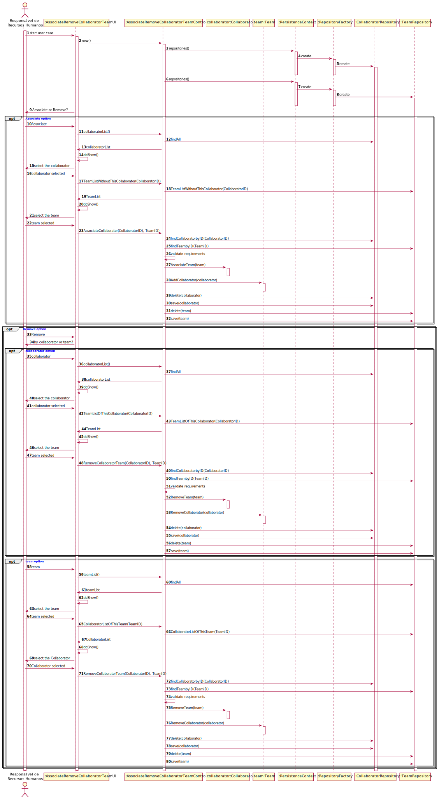

US2053 - Associar ou Remover Colaborador a uma equipa
=======================================

# 1. Requisitos

O Responsável de Recursos Humanos (RRH) pretende associar/remover um colaborador a uma equipa. Um colaborador pode pertencer a uma ou mais equipa. Contudo, não poderá pertencer a duas equipas do mesmo tipo. Assim está UC é dependente das UCs 2052 (Criação de uma nova equipa) e 2054 (Registo de um novo tipo de equipa).

# 2. Análise

Este caso de uso pretende permitir associar/remover um colaborador a uma equipa. Um colaborador pode estar associado a várias equipas distintas e uma equipa pode ter vários colaboradores associados. Ao remover o último colaborador de uma equipa é enviada uma mensagem de aviso.

## 2.1 Pré-requisito

* Colaborador e Equipa definidos
  
* Equipa com colaborador associado

## 2.2 Pós-requisito

* Colaborador associado ou removido à Equipa

# 3. Design

O diagrama doptado foi o diagrama de sequência, a fim de descrever o fluxo de realização do caso de uso. Satisfazendo a funcionalidade desejada.

## 3.1. Realização da Funcionalidade

Quando o ator inicia o caso de uso: o sistema solicita a escolha da opção (Associar ou Remover), caso o utilizador escolha a opção associar, é apresentado a lista dos colaboradores, o utilizador selecioana um e a seguir é apresentado a lista de equipas em que este colaborador não está associado, o utilizador seleciona a equipa a que pretende associar, é validado se o colaborador não pertence a outra equipa do mesmo tipo, e caso não, a informação é atualizada na base de dados. 

Caso a opção seja Remover, o sistema questiona se será por colaborador ou por equipa, caso seja por colaborador, o sistema apresenta a lista dos colaboradores, o colaborador é seleciona e a seguir é apresentado a lista de equipas que este colaborador faz parte, a equipa desejada é selecionada e a informação da remoção é atualizada na base de dados. Caso seja escolhida a opção por equipa, o sistema apresenta a lista de equipas, a equipa é seleciona e a seguir é apresentado a lista de colaboradores da equipa, o colaborador desejado é selecionado e os dados da remoção são atualizados na base de dados.

**Fluxo Aternativo:**
 
 * Caso o utilizador já faça parte de uma equipa do mesmo tipo da selecionada (no caso da associação), é apresentado um aviso e a caso de uso termina.
 * Caso o colaborador não esteja associado a nenhuma equipa (no caso da remoção), é apresentado um aviso e a caso de uso termina.

**SD:**

## 3.2. Padrões Aplicados

*Nesta secção deve apresentar e explicar quais e como foram os padrões de design aplicados e as melhores práticas.*

## 3.3. Testes 

*Nesta secção deve sistematizar como os testes foram concebidos para permitir uma correta aferição da satisfação dos requisitos.*

**Teste 1:** Verificar que não é possível criar uma instância da classe Exemplo com valores nulos.

	@Test(expected = IllegalArgumentException.class)
		public void ensureNullIsNotAllowed() {
		Exemplo instance = new Exemplo(null, null);
	}

# 4. Implementação

*Nesta secção a equipa deve providenciar, se necessário, algumas evidências de que a implementação está em conformidade com o design efetuado. Para além disso, deve mencionar/descrever a existência de outros ficheiros (e.g. de configuração) relevantes e destacar commits relevantes;*

*Recomenda-se que organize este conteúdo por subsecções.*

# 5. Integração/Demonstração

*Nesta secção a equipa deve descrever os esforços realizados no sentido de integrar a funcionalidade desenvolvida com as restantes funcionalidades do sistema.*