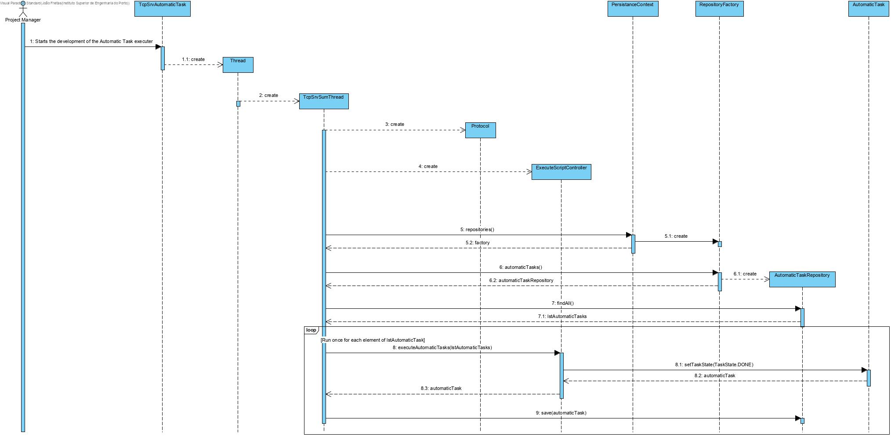

# UC 5001/5003 - Como Gestor de Projeto, eu pretendo que seja desenvolvido o Executor de Tarefas Automáticas, tornando mais robusto e executando o script para
validações de gramática.

# 1. Requisitos
**5001** Como Gestor de Projeto pretendo que seja desenvolvido a componente do Executor de Tarefas automáticas.
	* Demo5001.2 deve ser usado o protocolo de aplicação fornecido (SDP2021). 
 	* Demo5001.3 deve ser suportado o processamento simultaneo de pedidos para execução de tarefas automáticas.
		* Demo5001.3.1 para tal deverão ser já criadas e persistidas as atividades automáticas no sistema.
 	* Demo5001.4 para efeitos de demonstração, é aceitável que a execução das tarefas automáticas seja apenas simulada (mock).
		* Demo 5001.4.1 para tal deverão ser utilizados mocks (@MockAnnotation)
	* Demo5001.5 deverá ser criado um motor de execução de tarefas.
	
**5003** Como Gestor de Projeto, eu pretendo que a equipa conclua o desenvolvimento do Executor de Tarefas Automáticas tornando-o bastante robusto.	
	* Demo5003.1 refinar a UC5001
	* Demo5003.2 as expressões da linguagem/gramática desenvolvida devem ser executadas/interpretadas (e.g. script de tarefa automática).
		*Demo5003.2.1 deve ser desenvolvida uma linguagem ANTLR4 onde valide os campos da atividade automática, e implementado Visitors para
		apartir da linguagem, ser possivel ler e validar dados de um ficheiro xml, para posterior realização da atividade (seja enviar email, validar o idCliente,etc).

A interpretação feita deste requisito foi no sentido de criar um executor de tarefas automáticas.

##1.1 Pré-Requisitos 
	Para definir um Executor de Tarefas automáticas, é requisito que:
		- Existam tarefas automáticas criadas e persistidas na base de dados. 
		- Exista um gestor de Gestor de Projetos registado no sistema.
		- Exista uma gramatica ANTLR4 definida (usada em validações).
		- Exista um script para executar certa atividade de uma tarefa automática. 

# 2. Análise
Segundo o caderno de encargos, existem atividades automaticas, execuntando certa atividade através de um script
	
	* A Componente representativa de um executor de tarefas automaticas é o que permite realizar determinadas
	atividades automáticas.
	
	* Necessita de um script de validação para envio de dados, numa atividade automatica
	especificada aquando da inclusão do componente num fluxo de atividades.

## 3.1. Realização da Funcionalidade

## 3.2. Diagrama de Classes
Por indicação do professor, não é necessário elaborar o Diagrama de Classes.	

# 3.3. Padrões Aplicados
Protocolo SDP2021.
	
# 4. Implementação
Todas as representações do design efetuado estão de acordo com a implementação.