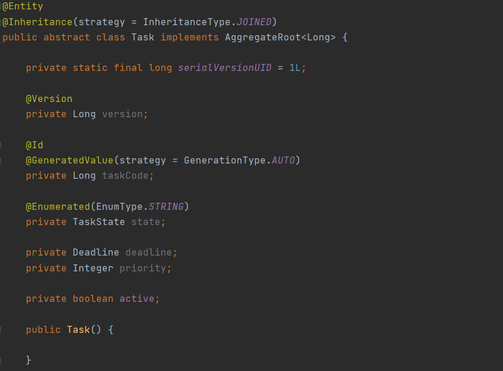
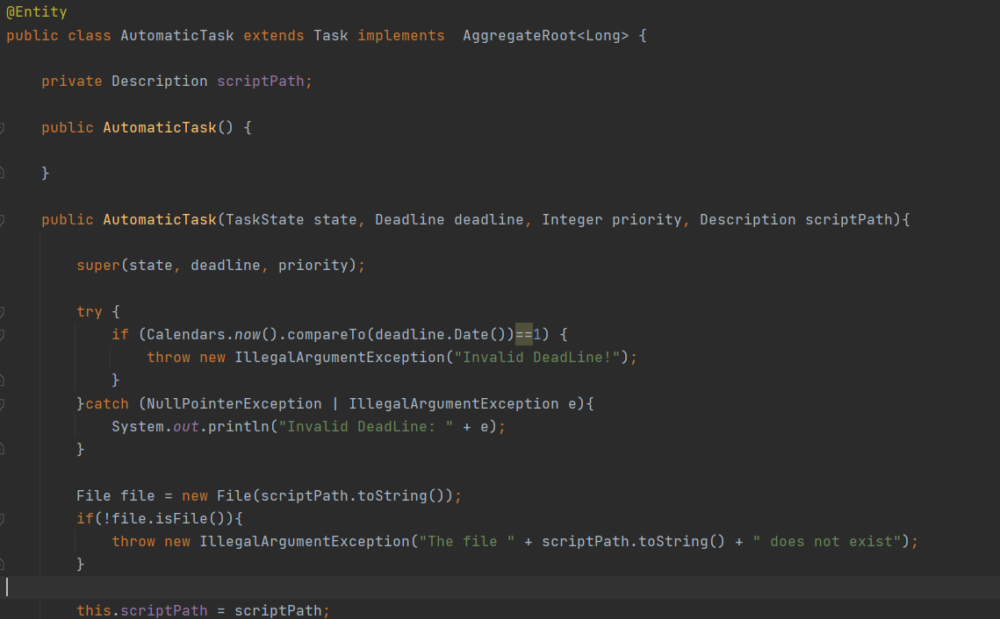

# US1006 - Componente da Tarefa Automática
=======================================

# 1. Requisitos

Como Gestor de Projeto, eu pretendo que seja desenvolvida a componente representativa de uma tarefa 
automática dedicada à execução de um script no âmbito de um pedido e que a mesma seja adicionada à 
biblioteca de atividades típicas do sistema para, dessa forma, poder ser usada na definição de fluxos 
de atividades.

# 2. Análise

Segundo o caderno de encargos, existem dois tipos de tarefas: as manuais e as automáticas. As tarefas 
automáticas são executadas sem intervenção de pessoas, ou seja, pela execução de um script. Por causa 
deste cenário achamos apropriado implementar o conceito de herança na criação da componente, para que o 
sistema que suporte as tarefas automáticas e outras tarefas futuras. Assim, a classe abstrata é composta pelos
campos em comum das tarefas e as concretas pelos seus campos individuais.

## 2.1 Pós-requisito

* Componente Tarefa Automática definida.

# 3. Padrões Aplicados

* **Herança:** Para suportar diferentes tipos de tarefas no sistema.

## 3.1. Testes 

*Nesta secção deve sistematizar como os testes foram concebidos para permitir uma correta aferição da 
satisfação dos requisitos.*

**Teste 1:** Verificar que não é possível criar uma instância da classe Exemplo com valores nulos.

	@Test(expected = IllegalArgumentException.class)
		public void ensureNullIsNotAllowed() {
		Exemplo instance = new Exemplo(null, null);
	}

# 4. Implementação

A classe abstrata Task:

A classe concreta AutomaticTask:

# 5. Integração/Demonstração

Foi utilizado o conceito de herança exatamente para melhor integração da componente no sistema. 
Assim, é possível criar uma tarefa automática com a funcionalidade de execução de scrip já desenvolvida,
e ainda criar novos tipos de tarefas, que resulta da reutilização de código.

