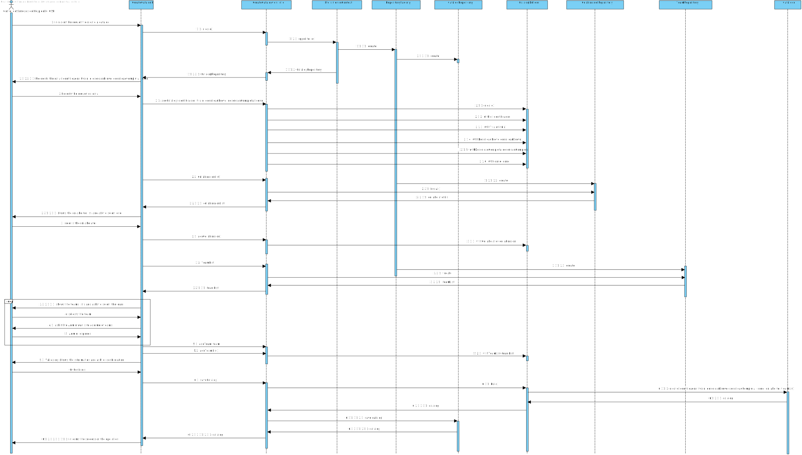

# US2001 - Como Gestor de Serviços de Help desk (GSH), eu pretendo criar um novo catálogo de serviços.
=======================================

# 1. Requisitos

**US2001** Como Gestor de Serviços de Help desk pretendo criar um novo catálogo de serviços.

- 2001.1. Como Gestor de Serviços de Help desk pretendo criar um novo catálogo de serviços atribuindo-lhe uma descrição breve.

- 2001.2. Como Gestor de Serviços de Help desk pretendo criar um novo catálogo de serviços atribuindo-lhe uma descrição completa.

- 2001.3. Como Gestor de Serviços de Help desk pretendo criar um novo catálogo de serviços atribuindo-lhe um identificador.

- 2001.4. Como Gestor de Serviços de Help desk pretendo criar um novo catálogo de serviços atribuindo-lhe um ícone.

- 2001.5. Como Gestor de Serviços de Help desk pretendo criar um novo catálogo de serviços atribuindo-lhe um título.

- 2001.6. Como Gestor de Serviços de Help desk pretendo criar um novo catálogo de serviços atribuindo-lhe um colaborador responsável.

- 2001.7. Como Gestor de Serviços de Help desk pretendo criar um novo catálogo de serviços atribuindo-lhe uma ou mais equipas que podem aceder ao catálogo.

- 2001.8. Como Gestor de Serviços de Help desk pretendo criar um novo catálogo de serviços atribuindo-lhe um nível de criticidade.

- 2001.9. Como Gestor de Serviços de Help desk pretendo criar um novo catálogo de serviços atribuindo-lhe uma lista de serviços.

A interpretação feita deste requisito foi no sentido de criar um catálogo com todos os atributos necessários para a sua criação.

# 2. Análise

	A análise foi realizada tendo em conta as reuniões com o Cliente e as respostas dadas no Fórum para esclarecimento de dúvidas.

	* O catálogo é identificado por um Identificador, por um Ícone e por um título que devem ser únicos.
	* O título deve ter um máximo de 50 caracteres.
	* O catálogo é caraterizado por uma descrição breve e por uma descrição completa.
	* A descrição breve deve ter um máximo de 40 caracteres.
	* A descrição completa deve ter um máximo de 100 caracteres.
	* O catálogo tem associado um nível de criticidade.
	* O catálogo tem um colaborador responsável.
	* O catálogo só pode ser acedido por uma ou mais equipas.
	* O catálogo é constituído por uma lista de serviços.
	* O catálogo tem de ter, obrigatoriamente, todos os seus atributos completos para puder ser criado.

# 3. Design

	Para realizar esta funcionalidade a equipa usou o padrão Controller e Repository e Builder.
	Foi criado o CriarCatalogoController que será responsável pela criação de um novo catálogo de serviços no sistema.
	Para persistir a informação no sistema usou-se o padrão Repository.
	Dado que um catálogo possui um ou mais calaboradores responsáveis, umas ou mais equipas que têm acesso, e um ou mais serviços, este irá buscar os colaboradores, equipas e serviços disponíveis para serem selecionados.
	Dado também que um catálogo possui um nivel de criticidade este irá buscar os niveis de criticidade disponiveis para posteriormente ser selecionada o que melhor se adequa.
	Após serem selecionados e introduzidos todas as informações necessárias é criado um catálogo.
	O Controller assim utilizada a Classe Catalogo para puder crar uma instância de um catálogo.
	O Controller usa o CatalogoRepository para guardar a informação sobre esse novo catálogo criado na base de dados.

## 3.1. Realização da Funcionalidade

## 3.2. Diagrama de Classes

Por indicação do professor, não é necessário elaborar o Diagrama de Classes.

## 3.3. Padrões Aplicados

O padrão aplicado foi o padrão Controller e Repository e Builder.

## 3.4. Testes 

Os testes aplicados a esta funcionalidade são os seguinstes:

**Teste 1:** Verificar que não é possível criar uma instância da classe Catalogo com valores nulos no titulo.

	@Test(expected = IllegalArgumentException.class)
		public void ensureCatalogCantHaveNull<titulo>() {
		Catalogo catalogo1 = new Catalogo(every field not null except titulo);
	}

**Teste 2:** Verificar que não é possível criar uma instância da classe Catalogo com valores nulos na descricaoBreve.

	@Test(expected = IllegalArgumentException.class)
		public void ensureCatalogCantHaveNull<descricaoBreve>() {
		Catalogo catalogo2 = new Catalogo(every field not null except descricaoBreve);
	}

**Teste 3:** Verificar que não é possível criar uma instância da classe Catalogo com valores nulos na descricaoCompleta.

	@Test(expected = IllegalArgumentException.class)
		public void ensureCatalogCantHaveNull<descricaoCompleta>() {
		Catalogo catalogo3 = new Catalogo(every field not null except descricaoCompleta);
	}

**Teste 4:** Verificar que não é possível criar uma instância da classe Catalogo com valores nulos no icone.

	@Test(expected = IllegalArgumentException.class)
		public void ensureCatalogCantHaveNull<icone>() {
		Catalogo catalogo4 = new Catalogo(every field not null except icone);
	}

**Teste 5:** Verificar que não é possível criar uma instância da classe Catalogo com valor nulo na lista de colaboradores responsáveis.

	@Test(expected = IllegalArgumentException.class)
		public void ensureCatalogCantHaveNull<colaboradores>() {
		Catalogo catalogo5 = new Catalogo(every field not null except colaboradores);
	}

**Teste 6:** Verificar que não é possível criar uma instância da classe Catalogo com valor nulo na lista de equipas que têm acesso.

	@Test(expected = IllegalArgumentException.class)
		public void ensureCatalogCantHaveNull<equipas>() {
		Catalogo catalogo6 = new Catalogo(every field not null except equipas);
	}

**Teste 7:** Verificar que não é possível criar uma instância da classe Catalogo com valor nulo no nivel de criticidade.

	@Test(expected = IllegalArgumentException.class)
		public void ensureCatalogCantHaveNull<nivelDeCriticidade>() {
		Catalogo catalogo7 = new Catalogo(every field not null except nivelDeCriticidade);
	}

**Teste 8** Verificar que não é possível criar uma instância da classe Catalogo com o titulo a não obedecer às restrições do cliente

	public boolean ensureTituloMatchesCriteria(Description titulo){
			if(titulo <= 50){
				return true;
			}else{
				return false;
			}
	}

**Teste 9** Verificar que não é possível criar uma instância da classe Catalogo com a descricao breve a não obedecer às restrições do cliente

	public boolean ensureTituloMatchesCriteria(Description descricaoBreve){
			if(descricaoBreve <= 40){
				return true;
			}else{
				return false;
			}
	}

**Teste 10** Verificar que não é possível criar uma instância da classe Catalogo com a descricao completa a não obedecer às restrições do cliente

	public boolean ensureTituloMatchesCriteria(Description descricaoCompleta){
			if(descricaoCompleta <= 100){
				return true;
			}else{
				return false;
			}
	}

# 4. Implementação

Visualizar projeto.

# 5. Integração/Demonstração

Após ter sido criado o Catálogo este irá aparecer na Base de Dados.

# 6. Observações

Nenhuma observação

