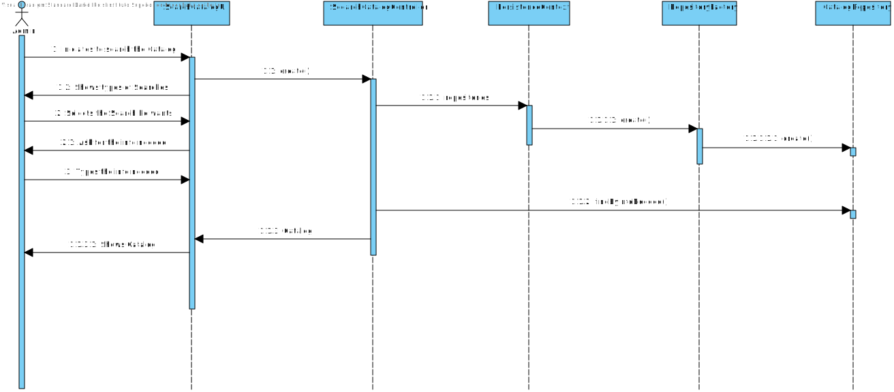

# US2001 - Como Gestor de Serviços de Help desk (GSH), eu pretendo criar um novo catálogo de serviços.
=======================================

# 1. Requisitos

**US3001** Como utilizador, eu pretendo consultar/pesquisar os catálogos de serviços e respetivos serviços que me estão/são disponibilizados.

A interpretação feita deste requisito foi no sentido de procurar um catálogo por determinada informação dele.

# 2. Análise

	A análise foi realizada tendo em conta as reuniões com o Cliente e as respostas dadas no Fórum para esclarecimento de dúvidas.
	
	Pesquisar catálogo por Titulo, Descrição Breve e Descrição Completa.

# 3. Design

	Para realizar esta funcionalidade a equipa usou o padrão Controller e Repository.

## 3.1. Realização da Funcionalidade

## 3.2. Diagrama de Classes

Por indicação do professor, não é necessário elaborar o Diagrama de Classes.

## 3.3. Padrões Aplicados

O padrão aplicado foi o padrão Controller e Repository.

## 3.4. Testes 

Os testes aplicados a esta funcionalidade são os seguinstes:

# 4. Implementação

*Nesta secção a equipa deve providenciar, se necessário, algumas evidências de que a implementação está em conformidade com o design efetuado. Para além disso, deve mencionar/descrever a existência de outros ficheiros (e.g. de configuração) relevantes e destacar commits relevantes;*

*Recomenda-se que organize este conteúdo por subsecções.*

# 5. Integração/Demonstração

As pesquisas foram realizadas para os catálogos devido a US's estarem atrasadas

# 6. Observações

Fornecer mais tipos de pesquisas após estarem cumpridas US's em atraso.

