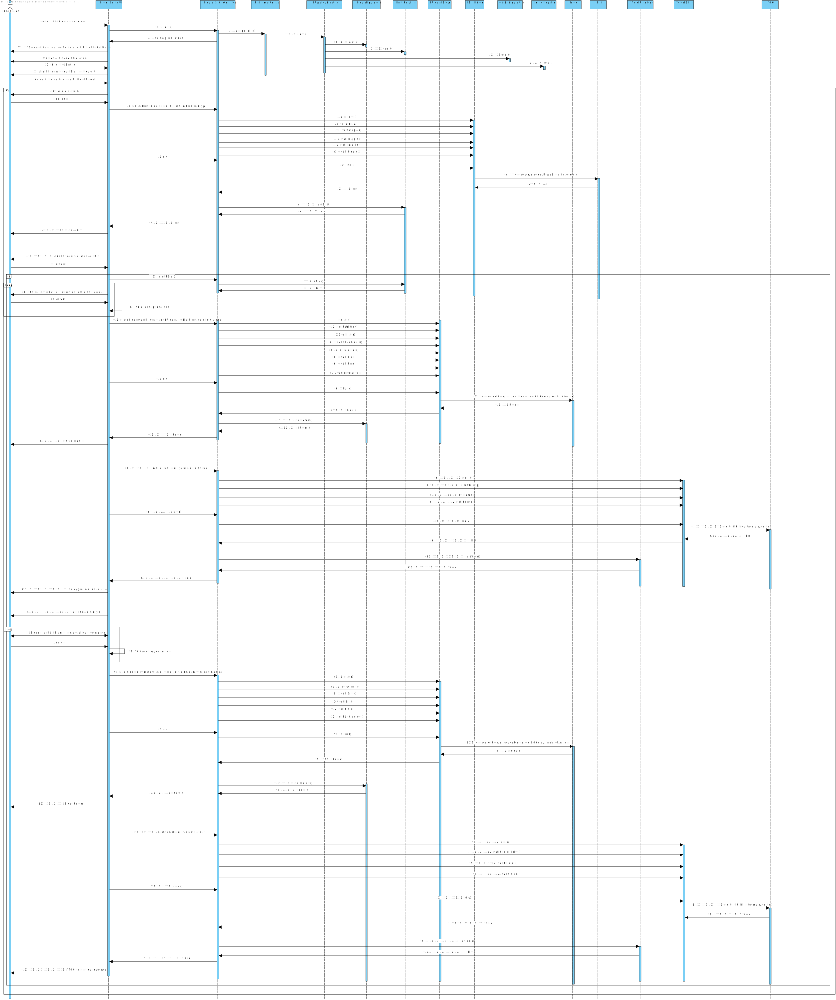

# US3003 - Como utilizador, eu pretendo solicitar um serviço do catálogo de serviços que me é disponibilizado.
=======================================

# 1. Requisitos

**US3003** Como utilizador, eu pretendo solicitar um serviço do catálogo de serviços que me é disponibilizado.

- Pré-Requisitos
		- Conclusão da US 3002 do sprint passado;
		- Conclusão da US 1004 do sprint passado;
		- Conclusão da US 1007 do sprint atual;

- Requisitos
		- Solicitar o serviço pretendido;
		- Preenchimento do Pedido para ser submetido;
		- Preenchimento do Formulário;
		- Scripts para validar o Formulários;
		- Scripts para validar as respostas dadas aos Atributos do Formulário;
		- Gerar o Ticket;

- Pós-Requisitos
		- Validações sobre o Formulário;
		- Validações sobre as respostas dadas aos Atributos do Formulário;
		- Solicitação realizada;
		- Gerar Ticket do Pedido que se encontra associado;

A interpretação feita deste requisito foi no sentido de um utilizador puder solicitar um serviço de um catálogo do qual ele tem acesso. Ao solicitar esse serviço terá de preencher o Pedido e o Formulário correspondente ao Serviço solicitado. Ao preencher o Formulário este será validado e também as respostas dadas aos Atributos do mesmo.

# 2. Análise

	A análise foi realizada tendo em conta as reuniões com o Cliente e as respostas dadas no Fórum para esclarecimento de dúvidas.

	*A Pesquisa do serviço é realizada por catálogo;
	*Toda a informação do Formulário tem de ser preenchida;
	*O Pedido tem de ter toda a informação necessária;
	*Todos os Formulários têm de ser validados por  um script;
	*Todas as respostas dadas aos Atributos dos Formulários têm de ser validades por um script;
	*Após ser feita a solicitação de um Serviço, tem de ser gerado um ticket relativo a esse Pedido;

# 3. Design

Para a realização desta funcionalidade a equipa usou os padrões Controller, Repository e Builder.
Foi criado o controller RequestServiceController que será responsável pela criação quer do Draft quer do Pedido submetidoe quer do Ticket gerado.
Para se persistir a informação no sistema usou-se o padrão Repository.
Após o Colaborador dar as informações necessárias será gerado ou um Draft no caso de ele não querer já submeter ou o Pedido para ser submetido.
Após o Pedido ser criado e submetido será gerado um Ticket desse mesmo Pedido.

## 3.1. Realização da Funcionalidade

## 3.2. Diagrama de Classes

Por indicação do professor, não é necessário elaborar o Diagrama de Classes.

## 3.3. Padrões Aplicados

O padrão aplicado foi o padrão Controller e Repository e Builder.

## 3.4. Testes 

**Teste 1 ... :** Verificar que não é possível criar uma instância de um Draft com valor nulos

	@Test(expected = IllegalArgumentException.class)
		public void ensureDraftCantAllowedNulls() {
		Draft draft = new Exemplo(any attribute null );
	}

# 4. Implementação

*Nesta secção a equipa deve providenciar, se necessário, algumas evidências de que a implementação está em conformidade com o design efetuado. Para além disso, deve mencionar/descrever a existência de outros ficheiros (e.g. de configuração) relevantes e destacar commits relevantes;*

*Recomenda-se que organize este conteúdo por subsecções.*

# 5. Integração/Demonstração

*Nesta secção a equipa deve descrever os esforços realizados no sentido de integrar a funcionalidade desenvolvida com as restantes funcionalidades do sistema.*

# 6. Observações

*Nesta secção sugere-se que a equipa apresente uma perspetiva critica sobre o trabalho desenvolvido apontando, por exemplo, outras alternativas e ou trabalhos futuros relacionados.*

