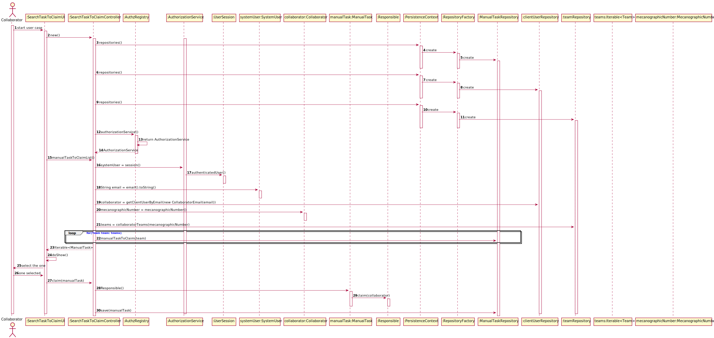

# US3022 - Search Manual Task To Claim
=======================================

# 1. Requisitos

Como utilizador, eu pretendo consultar as tarefas pendentes que eu posso reivindicar para mim e, 
caso o deseje, concretize essa reivindicação.

# 2. Análise

Uma tarefa pode ser diretamente assignada pelo a um colaborador e, portanto, cabe ao colaborador
assignado realizar essa tarefa, ou a tarefa pode ser assignada a qualquer colaborador pertencente 
a uma determinada equipa. Neste caso, qualquer colaborador dessa equipa pode/deve reivindicar (claim).
Assim, as tarefas que o colaborador pode reinvindicar são aquelas que estão assignadas à equipa em 
que ele pertence.

## 2.1. Pré-requisito

* Tarefas Manuais já definidas

## 2.2. Pós-requisito

* Tarefa reivindicada ao Colaborador

# 3. Design

O diagrama doptado foi o diagrama de sequência, a fim de descrever o fluxo de realização do caso de uso.
Satisfazendo a funcionalidade desejada.

## 3.1. Realização da Funcionalidade

**SD:**

O caso de começa quando o utilizador solicita a reivindicação da tarefa, o sistema
mostra as tarefas que ele pode reinvindicar, ele seleciona uma e confirma
a reinvindicação e a tarefa é reinvindicada para o utilizador.

## 3.2. Padrões Aplicados

Foram aplicados os padrões:
* **Repository:** Para comunicar com a base de dados, ter acesso aos dados
  por meio das queries feitas.
* **Use-Case Controller:** Para gerir o fluxo de execução do caso de uso. 

## 3.3. Testes

**Teste 1:** Verificar que não é possível reivindicar uma tarefa que não consta na base de dados.

	@Test(expected = IllegalArgumentException.class)
    public void ensureManualTaskExist() {
          ManualTask manualTask = new ManualTask(...);
          claim(manualTask);
	}

