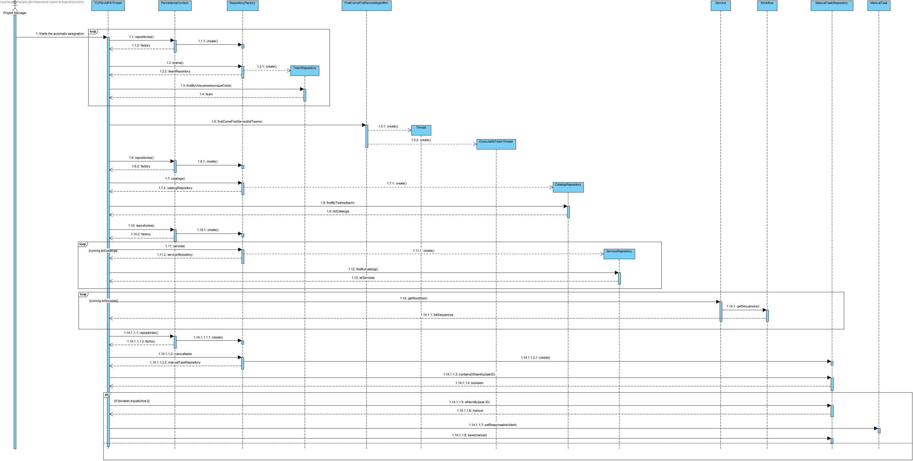

# US 4072

# 1. Requisitos
**4072** Como Gestor de Projeto, eu pretendo que seja desenvolvido e integrado no Motor de Fluxos de Atividades algoritmos que assignem automáticamente tarefas a colaboradores de forma a evitar que essas tarefas tenham que ser reivindicadas pelos mesmos.
 - Demo4072.1 assignar atividade automática por ordem de chegada.
 - Demo4072.2 assignar atividade automática de acordo com um estudo detalhado de cálculo de tarefas pendentes e do tempo médio de execução.
 
# 2. Análise
A análise foi realizada tendo em conta as reuniões com o Cliente e as respostas dadas no Fórum para esclarecimento de dúvidas.
- As tarefas a assignar são tarefas manuais.
- As tarefas são caracterizadas for uma executor.
- O executor é caracterizada por um identificador único.
- O executor é caracterizada por um colaborador.

## Pre-requisitos
- É necessário existirem colaboradores registados no sistema.
- É necessário existirem serviços registados no sistema.
- É necessário existirem pedidos registados no sistema e consequentemente tickets.
- É necessário existirem atividades manuais registadas no sistema.

## Pós-requisitos
- As tarefas manuais incluidas em determinado pedido de um serviço têm que estar atribuidas a um colaborador.

## 3.1. Realização da Funcionalidade

## 3.2. Diagrama de Classes
Por indicação do professor, não é necessário elaborar o Diagrama de Classes.

# 4. Implementação
Todas as representações do design efetuado estão de acordo com a implementação.